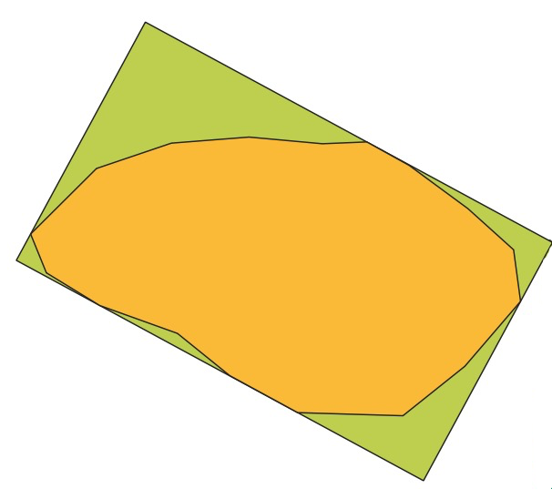

---
tags:
  - adv
  - prospetti
---
## Possibili indici di regolarità: perimetro
Sulla base dell'assioma che la distanza più corta tra due punti è la reta che li collega, possiamo usare il perimetro per calcolare la regolarità della muratura.
Questo indice funziona bene con forme sub-quadrangolari:

Di contro, ci si aspetta che non funzioni altrettanto bene con forme tendenti al triangolare:


---

Quindi, la formula per ricavare la differenza di perimetro in termini assoluti potrebbe essere calcolato dalla formula:

`perimetro della rettangolo regolare (bbox) -  perimetro del poligono attuale`

Ovvero:

```
perimeter(
	oriented_bbox( $geometry )
) 
- 
perimeter( $geometry ) 
```

## Possibili indici di regolarità: superficie
L'uso della superficie, invece, ci permette di calcolate con maggiore precisione le aree di differenza tra il poligono regolare (bbox) e quello attuale:

`area del poligono regolare - area della geometria corrente`

Questa differenza può essere resa relativa se la dividiamo per l'area del poligono regolare:
`(area del poligono regolare - area della geometria corrente) / area del poligono regolare`

Ovvero:

```
(
  area(
    oriented_bbox( $geometry )
  )
  -
  area( $geometry )
)
/
area(
  oriented_bbox($geometry)
)
```

## Analisi del rapporto larghezza/altezza

```
round( "bbw" / "bbh" , 3)
```

Simbologia: graduato, usando come valore la formula `round( "bbw" / "bbh" , 3)` e come modo di la [Deviazione Standard](https://en.wikipedia.org/wiki/Standard_deviation)

---
Prossimo passo:
- [Analisi preliminare delle misure romane](Analisi%20preliminare%20delle%20misure%20romane.md)