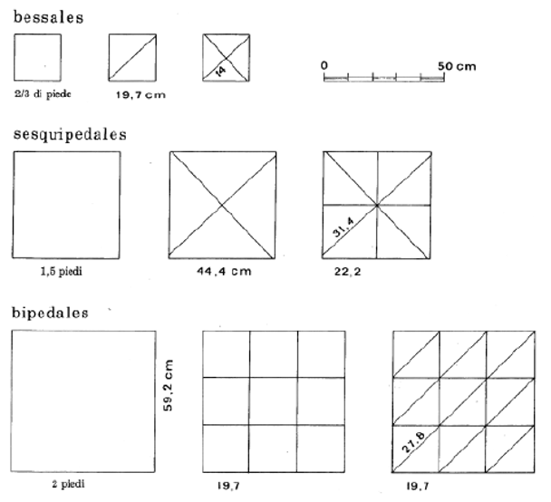

---
tags:
  - adv
  - prospetti
---

|               |       | Intero | spezzato 2 | spezzato 4        | spezzato 8  | spezzato 9  | spezzato 18      |
| ------------- | ----- | ------ | ---------- | ----------------- | ----------- | ----------- | ---------------- |
|               | piedi | lato   | diagonale  | 1/2 di  diagonale | 1/2 di lato | 1/3 di lato | 1/3 di diagonale |
| bessales      | 0.67  | 0.198  | 0.28       | 0.14              |             |             |                  |
| ~~pedales~~   | ~~1~~ | 0.296  | 0.419      |                   |             |             |                  |
| sesquipedales | 1.5   | 0.444  | 0.628      | 0.314             | 0.222       |             |                  |
| bipedales     | 2     | 0.592  | 0.837      | 0.419             | 0.296       | 0.197       | 0.279            |

|               | prec. mm | prec.cm  |
| ------------- | -------- | -------- |
| bessales      | 0.14     | 0.14     |
| bipedales     | 0.197    | 0.2      |
| bessales      | 0.198    | ↑        |
| sesquipedales | 0.222    | 0.22     |
| bipedales     | 0.279    | 0.28     |
| bessales      | 0.28     | ↑        |
| pedales       | 0.296    | 0.3      |
| bipedales     | ↑        | ↑        |
| sesquipedales | 0.314    | 0.31 (↑) |
| pedales       | 0.419    | 0.42     |
| bipedales     | ↑        | ↑        |
| sesquipedales | 0.444    | 0.44     |
| bipedales     | 0.592    | 0.59     |
| sesquipedales | 0.628    | 0.63     |

---
Prossimo passo:
- [Creazione dei campi virtuali con le misure ricavate](Creazione%20dei%20campi%20virtuali%20con%20le%20misure%20ricavate.md)
