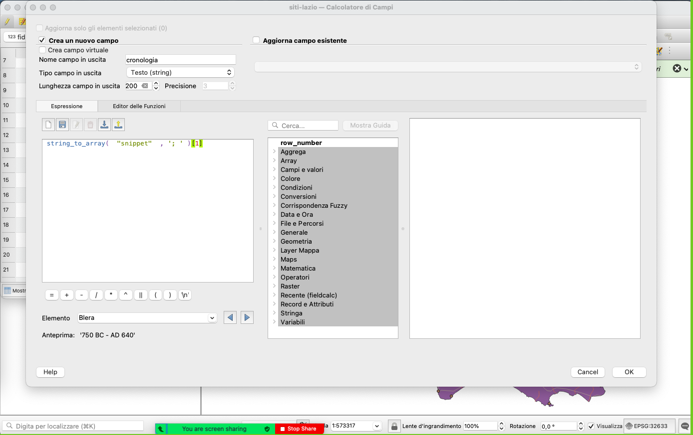

---
tags:
  - adv
---
# Calcolatore di campi
Data set:
- Luoghi Pleiades del Lazio

## Dividere il campo `snippet` in layer `siti`, in modo da separare la `tipologia` da `cronologia`, a sua volta `da`... `a`...

1. Calcolatore di campo
	1. Crea nuovo campo: `tipo`, testuale, lunghezza 100
	2. In espressione inserire `string_to_array(  "descrizione" , ';')[0]`
	
2. Calcolatore di campo
	1. Crea nuovo campo: `cronologia`, testuale, lunghezza 100
	2. In espressione inserire `string_to_array(  "descrizione" , ';')[1]`
	
3. Calcolatore di campo
	1. Crea nuovo campo: `cronoda`, integer, lunghezza 50
	2. In espressione inserire :
```
if(

    strpos(
        string_to_array(  "cronologia" , '-')[0],
        'AD'
    ) > 0,
    
    to_int(
        trim(
            replace(
                string_to_array(  "cronologia" , '-')[0],
                'AD ',
                ''
            )
        )
    ),
    
	to_int(
    	trim(
        	replace(
        	   string_to_array(  "cronologia" , '-')[0],
        	   'BC',
        	   ''
        	 )
         )
    ) * -1
    
)
```
4. Calcolatore di campo
	1. Crea nuovo campo: `cronoa`, integer, lunghezza 50
	2. In espressione inserire :
```
if(

    strpos(
        string_to_array(  "cronologia" , '-')[1],
        'AD'
    ) > 0,
    
    to_int(
        trim(
            replace(
                string_to_array(  "cronologia" , '-')[1],
                'AD ',
                ''
            )
        )
    ),
    
	to_int(
    	trim(
        	replace(
        	   string_to_array(  "cronologia" , '-')[1],
        	   'BC',
        	   ''
        	 )
         )
    ) * -1
    
)
```
5. Cancellare i campi  `descrizione` e `cronologia`
6. Cancellare tutti i siti che non sono insediamenti.

[< GIS avanzato - Preparazione dei dati](Preparazione%20dei%20dati.md)
[> Analisi a criteri multipli](Analisi%20a%20criteri%20multipli.md)