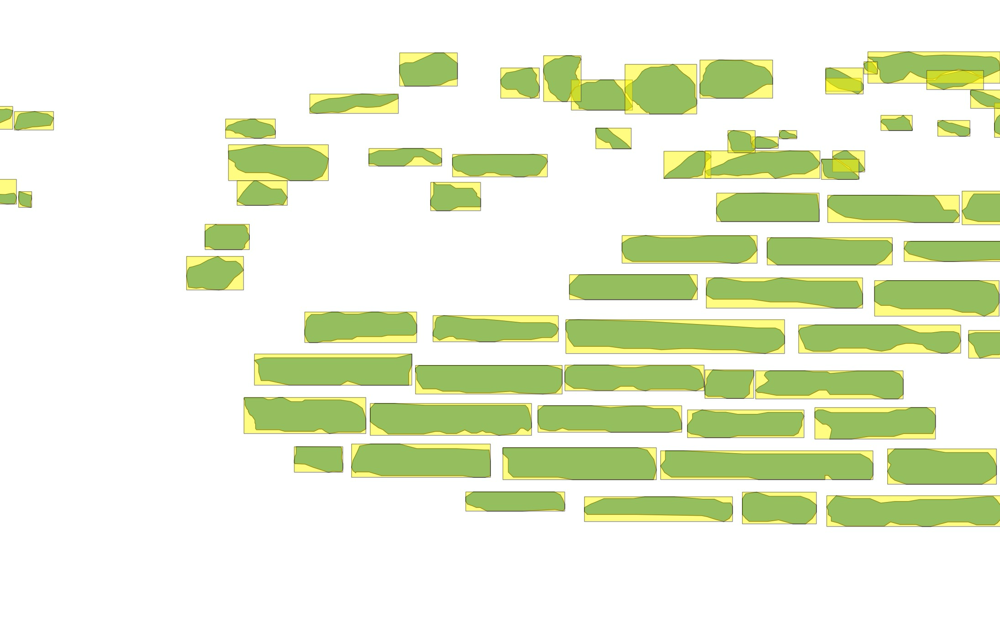

---
tags:
  - adv
  - prospetti
---
### Introduzione al concetto del **Bounding box** e dell'**Oriented bounding box**


Con il nostro esempio, **oriented bounding box** e :

**Bounding box non orientato**:

### Ricavare le dimensioni del BBOX orientato

#### Lunghezza

```
round(
  array_max(
    array(  
      distance(
        point_n( oriented_bbox($geometry), 1),
        point_n( oriented_bbox($geometry), 2)
      ),
      distance(  
        point_n( oriented_bbox($geometry), 2),
        point_n( oriented_bbox($geometry), 3)
      )
    )
  ),
  3
)
```

Spiegazione:
- `oriented_bbox`: Restituisce una geometria che rappresenta il perimetro di delimitazione minimo orientato di una geometria.
- `point_n`: Restituisce un nodo specifico da una geometria.
- `distance`: Restituisce la distanza minima (basata sul riferimento spaziale) tra due geometrie in unità proiettate.
- `array`: Restituisce un array contenente tutti i valori passati come parametro, es.:  
  ```
  array(2, 10) → [ 2, 10 ]
  ```
- `array_max`: Restituisce il valore massimo di un array (nel nostro caso la **lunghezza**), es.:
```
array_max(array(0, 42, 4, 2)) → 42
```
- `round`: Arrotonda un numero ad un numero di cifre decimali

#### Altezza
La formula è la stessa rispetto alla lunghezza, ma dalla lista prendo il valore più piccolo (`array_min`).

```
round(
  array_min(
    array(  
      distance(
        point_n( oriented_bbox($geometry), 1),
        point_n( oriented_bbox($geometry), 2)
      ),
      distance(  
        point_n( oriented_bbox($geometry), 2),
        point_n( oriented_bbox($geometry), 3)
      )
    )
  ),
  3
)
```
---
Prossimo passo
- [Analisi della regolarità](Analisi%20della%20regolarità.md)