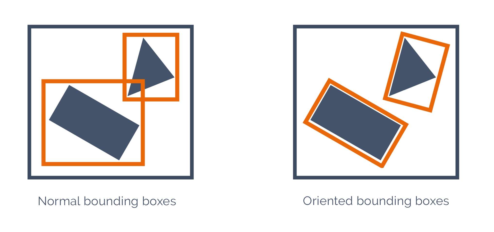

---
tags:
  - adv
  - prospetti
---
## 1. Dati
[Accesso ai dati](Accesso%20ai%20dati.md) > Dataset: `façade`

Contenuto dataset:
```
- facade.gpkg
- PNE_usm 47-b.dxf
- styles/distance-from-half-foot-multiple.qml
- styles/perimeter-difference-from-bbox.qml
- styles/relative-area-difference-from-bbox.qml
- styles/w-h-st-dev.qml
- styles/width-mapped-to-roman-standards.qml
```

---

# 2. Introduzione
Questo modulo è finalizzato all'utilizzo _non geografico_ di QGIS per l'analisi statistica ed automatizzata delle tessiture murarie.
Come dato di partenza verrà utilizzato un file AutoCAD con il rilievo di dettaglio di un prospetto murario, per comodità, con grandi superfici in laterizio, che verrà trasformato per rendere possibili analisi quantitative.
Per questo motivo verrà usato il prospetto PNE_usm 47-b degli scavi del Palatino (dir. prof.ssa M.Teresa D'Alessio).


---

## 3. Pre-processamento dei dati
### DWG -> DXF

Per l'uso di file CAD in QGIS è necessario salvare il file in formato AutoCAD DWG in formato [AutoCAD DXF](https://en.wikipedia.org/wiki/AutoCAD_DXF) utilizzando un programma CAD capace di leggere i file DWG. 
> **QGIS, per motivi di licenza, non gestisce i file proprietari DWG**.

Come risultato si ha il file di output `PNE_usm 47-b.dxf`
**Attenzione**: si tratta di una semplificazione del prospetto originario.
### Convertire le polilinee in poligoni
- Caricare il DXF in QGIS e convertire le linee in poligoni, ottenendo come output un layer temporaneo: `Vettore` > `Strumenti di geometria` > `Da linee a poligoni`  
  > Se fallisce, andare su impostazioni e selezionare `Salta (Ignora) Elementi con Geometrie non valide`.
- Impostare la trasparenza a 50% per verificare “a occhio” il risultato.
- Eventualmente correggere manualmente gli errori
- Eseguire un controllo di validità delle geometrie: `Vettore` > `Strumenti di geometria` > `Controllo di validità...`
- Nuovamente, sistemare manualmente possibili errori, eventualmente eseguire `Ripara geometrie`
- Dividere il poligono di `limite` dagli altri.

---

## 3. Introduzione al concetto del **Bounding box** e dell'**Oriented bounding box**


Con il nostro esempio, **oriented bounding box** e :

**Bounding box non orientato**:

## 4. Ricavare le dimensioni del BBOX orientato

**Formula per calcolare _al volo_ la lunghezza**:

```
round(
  array_max(
    array(  
      distance(
        point_n( oriented_bbox($geometry), 1),
        point_n( oriented_bbox($geometry), 2)
      ),
      distance(  
        point_n( oriented_bbox($geometry), 2),
        point_n( oriented_bbox($geometry), 3)
      )
    )
  ),
  3
)
```

**Spiegazione**:
- `oriented_bbox`: Restituisce una geometria che rappresenta il perimetro di delimitazione minimo orientato di una geometria.
- `point_n`: Restituisce un nodo specifico da una geometria.
- `distance`: Restituisce la distanza minima (basata sul riferimento spaziale) tra due geometrie in unità proiettate.
- `array`: Restituisce un array contenente tutti i valori passati come parametro, es.:  
  ```
  array(2, 10) → [ 2, 10 ]
  ```
- `array_max`: Restituisce il valore massimo di un array (nel nostro caso la **lunghezza**), es.:
```
array_max(array(0, 42, 4, 2)) → 42
```
- `round`: Arrotonda un numero ad un numero di cifre decimali

**Formula per calcolare _al volo_ l'altezza:**
La formula è la stessa rispetto alla lunghezza, ma dalla lista prendo il valore più piccolo (`array_min`).

```
round(
  array_min(
    array(  
      distance(
        point_n( oriented_bbox($geometry), 1),
        point_n( oriented_bbox($geometry), 2)
      ),
      distance(  
        point_n( oriented_bbox($geometry), 2),
        point_n( oriented_bbox($geometry), 3)
      )
    )
  ),
  3
)
```

---

## 5. Analisi della _regolarità_ dei blocchi
### Un possibile indice di regolarità: il perimetro
Sulla base dell'assioma che la distanza più corta tra due punti è la retta che li collega, possiamo usare il perimetro per calcolare la regolarità della muratura.
Questo indice funziona bene con forme sub-quadrangolari:

Di contro, ci si aspetta che non funzioni altrettanto bene con forme tendenti al triangolare:


---

Quindi, la formula per ricavare la differenza di perimetro in termini assoluti potrebbe essere calcolato dalla formula:

`perimetro della rettangolo regolare orientato (oriented_bbox) -  perimetro del poligono attuale`

Ovvero:

```
perimeter(
	oriented_bbox( $geometry )
) 
- 
perimeter( $geometry ) 
```

### Un possibile indice di regolarità: la superficie
L'uso della superficie, invece, ci permette di calcolate con maggiore precisione le aree di differenza tra il poligono regolare (bbox) e quello attuale:

`area del poligono regolare - area della geometria corrente`

Questa differenza può essere resa relativa se la dividiamo per l'area del poligono regolare:
```
(
	area del poligono regolare - area della geometria corrente
) / area del poligono regolare
```

Ovvero:

```
(
  area(
    oriented_bbox( $geometry )
  )
  -
  area( $geometry )
)
/
area(
  oriented_bbox($geometry)
)
```

### Un possibile indice di regolarità: il rapporto lughezza/altezza

```
round( "bbw" / "bbh" , 3)
```

Simbologia: graduato, usando come valore la formula `round( "bbw" / "bbh" , 3)` e come modalità la [Deviazione Standard](https://it.wikipedia.org/wiki/Scarto_quadratico_medio).

---

📖  **Approfondimento**: [QGIS – Modalità di classificazione](QGIS%20–%20Modalità%20di%20classificazione.md)

---

### Calcolo della distanza dal modulo del ’mezzo-piede’

```
round( "bbw" %  @pes , 2)
```

Attenzione: `%` è il simbolo dell'operazione **modulo**, sinonimo di `mod`.

Da [Wikipedia](https://it.wikipedia.org/wiki/Operazione_modulo):
> Tra i numeri interi è definita la funzione modulo, indicato con `mod`, che dà come risultato **il resto della divisione euclidea del primo numero per il secondo**.
> ...
> Per esempio, si ha `13 mod 3 = 1` , perché `⌊ 13 / 3 ⌋ = 4`   quindi `13 − ( 3 x 4 ) = 1` e dunque il resto è `1`. 


---

## 6. Analisi preliminare delle misure romane


Dalla figura, ricavo le principali dimensioni dei laterizi per ogni prodotto

|               |       | Intero | spezzato 2 | spezzato 4        | spezzato 8  | spezzato 9  | spezzato 18      |
| ------------- | ----- | ------ | ---------- | ----------------- | ----------- | ----------- | ---------------- |
|               | piedi | lato   | diagonale  | 1/2 di  diagonale | 1/2 di lato | 1/3 di lato | 1/3 di diagonale |
| bessales      | 0.67  | 0.198  | 0.28       | 0.14              |             |             |                  |
| ~~pedales~~   | ~~1~~ | 0.296  | 0.419      |                   |             |             |                  |
| sesquipedales | 1.5   | 0.444  | 0.628      | 0.314             | 0.222       |             |                  |
| bipedales     | 2     | 0.592  | 0.837      | 0.419             | 0.296       | 0.197       | 0.279            |

Le elenco in una tabella in ordine:

|               | prec. al millimetro | prec. al centimetro<br>(arrotondamento al terzo decimale) |
| ------------- | ------------------- | --------------------------------------------------------- |
| bessales      | 0.14                | 0.14                                                      |
| bipedales     | 0.197               | 0.2                                                       |
| bessales      | 0.198               | ↑                                                         |
| sesquipedales | 0.222               | 0.22                                                      |
| bipedales     | 0.279               | 0.28                                                      |
| bessales      | 0.28                | ↑                                                         |
| pedales       | 0.296               | 0.3                                                       |
| bipedales     | ↑                   | ↑                                                         |
| sesquipedales | 0.314               | 0.31 (↑)                                                  |
| pedales       | 0.419               | 0.42                                                      |
| bipedales     | ↑                   | ↑                                                         |
| sesquipedales | 0.444               | 0.44                                                      |
| bipedales     | 0.592               | 0.59                                                      |
| sesquipedales | 0.628               | 0.63                                                      |

---

## 8. Definire una visualizzazione con regole personalizzate per mappare le dimensioni delle misure romane al rilievo

Rule based styles, dove `n` è una misura di tolleranza definita come variabile di layer:
- **14 ±n: Bessales**
  `"bbw" BETWEEN (0.14-@tollerance) AND (0.14+@tollerance)`
- **20 ±n: Bipedales, Bessales**
  `"bbw" BETWEEN (0.2-@tollerance) AND (0.2+@tollerance)`
- **22 ±n: Sesquipedales**
  `"bbw" BETWEEN (0.22-@tollerance) AND (0.22+@tollerance)`
- **28 ±n: Bipedales,  Bessales**
  `"bbw" BETWEEN (0.28-@tollerance) AND (0.28+@tollerance)`
- **30 ±n: Pedales,  Bipedales**
  `"bbw" BETWEEN (0.3-@tollerance) AND (0.3+@tollerance)`
- **31 ±n: Sesquipedales**
  `"bbw" BETWEEN (0.31-@tollerance) AND (0.31+@tollerance)`
- **42 ±n: Pedales, Bipedales**
  `"bbw" BETWEEN (0.42-@tollerance) AND (0.42+@tollerance)`
- **44 ±n: Sesquipedales**
  `"bbw" BETWEEN (0.44-@tollerance) AND (0.44+@tollerance)`
- **59 ±n: Bipedales**
  `"bbw" BETWEEN (0.59-@tollerance) AND (0.59+@tollerance)`
- **63 ±n: Sesquipedales**
  `"bbw" BETWEEN (0.63-@tollerance) AND (0.63+@tollerance)`
- **84 ±n: Bipedales**
  `"bbw" BETWEEN (0.84-@tollerance) AND (0.84+@tollerance)`