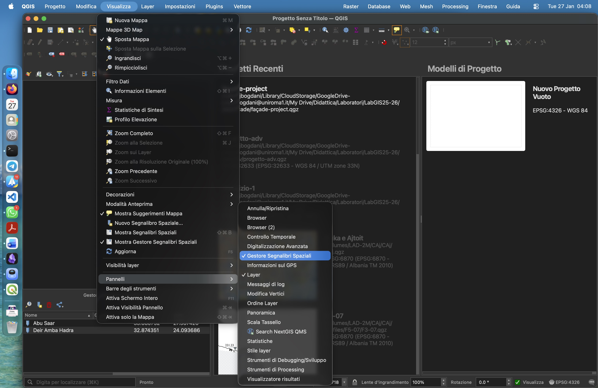
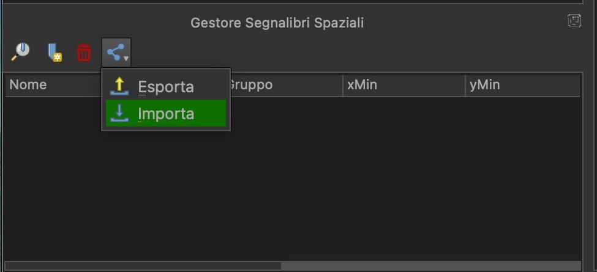

# Importare un segnalibro spaziale

📖 [https://docs.qgis.org/3.40/it/docs/user_manual/introduction/browser.html#spatial-bookmarks](https://docs.qgis.org/3.40/it/docs/user_manual/introduction/browser.html#spatial-bookmarks)

1. `Visualizza` > `Pannelli` > `Pannello Gestore Segnalibri Spaziali`

2. Click sul bottone `Condividi`
3. Click su `Importa`

4. Sfoglia e selezione il segnalibro da importare