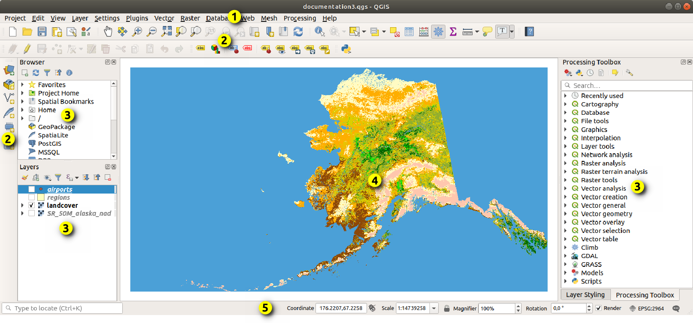

# Introduzione a QGIS
> QGIS è un Sistema di Informazione Geografica Open Source facile da usare, rilasciato sotto la GNU General Public License. QGIS è un progetto ufficiale della Open Source Geospatial Foundation (OSGeo). Funziona su Linux, Unix, Mac OSX, Windows e Android e supporta numerosi formati vettoriali, raster, database e funzionalità.

- Web: [https://www.qgis.org/](https://www.qgis.org/en/site/)
- Versione corrente:
	- **Long Term Release 3.40**
	- Latest Release 3.44
- Disponibile all'indirizzo [https://www.qgis.org/it/site/forusers/download.html](https://www.qgis.org/it/site/forusers/download.html) per:
	- Windows
	- MacOS
	- Linux
		- Debian/Ubuntu
		- Fedora
		- openSUSE
		- RHEL, CentOS, Scientific Linux, ...
		- Mandriva
		- Slackware
		- Arch Linux
		- Flatpak
	- BSD
	- Piattaforme mobile (QField, Input, IntraMaps Roam)

## Manuale utente
[https://docs.qgis.org/3.40/it/docs/user_manual/index.html](https://docs.qgis.org/3.40/it/docs/about/features.html)

## Funzionalità principali
[https://docs.qgis.org/3.40/it/docs/about/features.html](https://docs.qgis.org/3.40/it/docs/about/features.html)

## Interfaccia utente

1: Menu principale  
2: Toolbar  
3: Pannelli  
4: Vista mappa  
5: Barra di stato

## Plugin da installare per i lavoro del laboratorio
1. Accedere alla gestione dei plugin attraverso il menu principale:
   `Plugins > Gestisci e installa plugin...`
2. Cercare installare ed eventualmente attivare i seguenti plugin:
	- ~~Freehand raster georeferencer~~
	- [QuickMapServices](https://plugins.qgis.org/plugins/quick_map_services/)