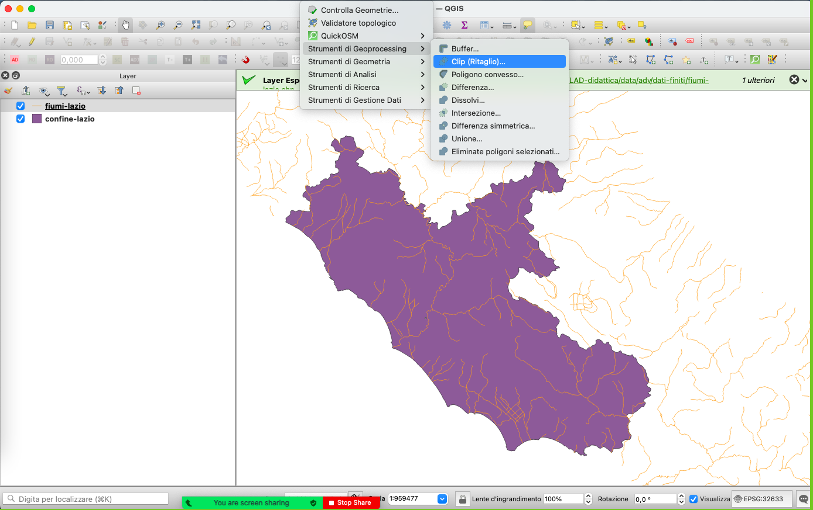
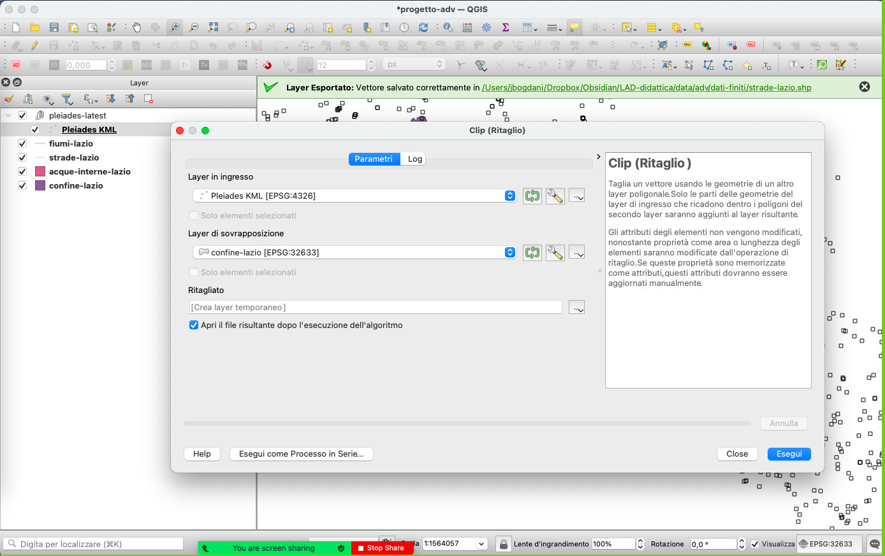

---
tags:
  - adv
---
# GIS modulo avanzato: preparazione dei dati
[Accesso ai dati](Accesso%20ai%20dati.md) > Dataset `adv`

1. Estrarre i limiti della regione Lazio
	1. Recuperare da `diva-gis/ITA_adm/ITA_adm1` il solo poligono della regione del Lazio
	2. Caricarlo su QGIS
	3. Selezionare il poligono del Lazio
	4. Esportare la selezione, **impostando come SR di destinazione EPSG: 32633**

2. Recuperare da `diva-gis/ITA_wat/ITA_water_lines_dcw` la rete fluviale entro gli attuali confini della regione Lazio

3. Recuperare da `awmc/inlandwater/inland_water_edits` solo i poligoni che si trovano entro gli attuali confini della regione Lazio

4. Recuperare da `awmc/inlandwater/ba_roads` solo le polilinee che si trovano entro gli attuali confini della regione Lazio
5. Recuperare da `pleiades/pleiades-latest.kmz` solo i siti che si trovano entro gli attuali confini della regione Lazio

[< GIS Avanzato - Introduzione](GIS%20Avanzato%20-%20Analisi%20multi-criterio.md)
[> Calcolatore dei campi](Calcolatore%20dei%20campi.md)